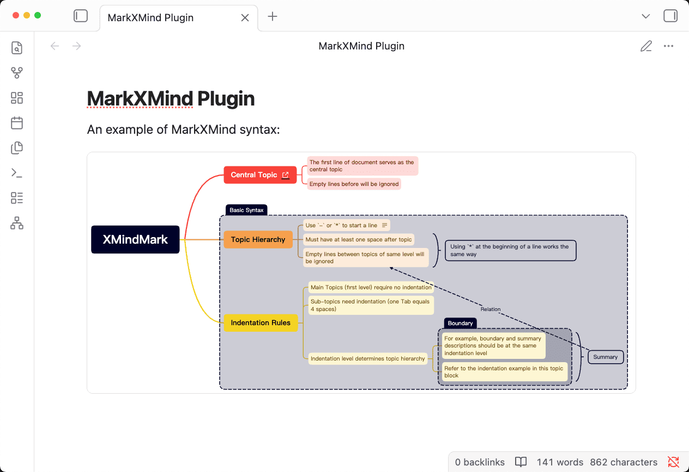

# MarkXMind Plugin for Obsidian

[](https://github.com/jinzcdev/obsidian-markxmind/releases/latest)
[](https://obsidian.md)
[](https://github.com/jinzcdev/obsidian-markxmind/blob/main/manifest.json)
[](https://github.com/jinzcdev/obsidian-markxmind/blob/main/LICENSE)
[](README_zh-CN.md)

Render **XMindMark** syntax (from [MarkXMind](https://github.com/jinzcdev/markxmind)) as XMind mind maps inside `xmind` code blocks in [Obsidian](https://obsidian.md).



## ✨ Features

- 📝 Parse `xmind` (or `xmindmark`) code blocks into XMind mind maps using XMindMark syntax
- 🔗 Support various markers
- 🌗 Light/dark theme support

## 📦 Installation

### Community Plugins

1. Open Obsidian **Settings** → **Community plugins** → **Browse**
2. Search for **MarkXMind**
3. Install and enable the plugin

### Manual Installation

1. Create the plugin folder in your vault: `.obsidian/plugins/markxmind/`
2. Copy these files into it: `main.js`, `styles.css`, `manifest.json` (Download the latest version from [Releases](https://github.com/jinzcdev/obsidian-markxmind/releases/latest)).
3. In Obsidian **Settings** → **Community plugins**, enable the **MarkXMind** plugin

## 📝 Usage Example

> 💡 **It is highly recommended to try [MarkXMind Online](https://markxmind.js.org/)** to learn XMindMark syntax and preview the result.

To add a mind map, create an `xmind` (or `xmindmark`) code block and write XMindMark syntax inside it.

````markdown
```xmind
XMindMark

- Central Topic[L:https://markxmind.js.org/]
    - The first line of document serves as the central topic
    - Empty lines before will be ignored
- Topic Hierarchy [B1]
    - Use `-` or `*` to start a line [N:This is a note]
    * Must have at least one space after topic[S]
    * Empty lines between topics of same level will be ignored[S][1]
    [S] Using `*` at the beginning of a line works the same way
- Indentation Rules [B1]
    - Main Topics (first level) require no indentation
    - Sub-topics need indentation (one Tab equals 4 spaces)
    - Indentation level determines topic hierarchy
        - For example, boundary and summary descriptions should be at the same indentation level [B1][S1]
        - Refer to the indentation example in this topic block [B1][S1]
        [B1] Boundary
        [S1] Summary[^1](Relation)
[B1] Basic Syntax
```
````

Syntax follows **XMindMark**:

- The first non-empty line is the **central topic**
- Lines starting with `-` or `*` are topics; indentation defines hierarchy
- Supports syntax: boundary `[B1]`, summary `[S]`, relationship `[1] with [^1](...)`, link `[L:url]`, note `[N:...]`, fold `[F]`, etc.

For full syntax and examples, see the [MarkXMind](https://github.com/jinzcdev/markxmind) project.

> [!TIP]
>
> **XMindMark** is a lightweight markup language for creating XMind mind maps; **MarkXMind** is an online tool for generating XMind mind maps using XMindMark syntax.

## 📄 License

MIT
